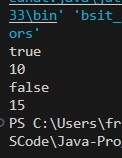
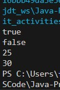
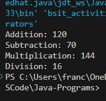
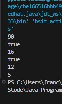

# Object-Oriented Programming - Activity # 2
📅 **Date:** 
Mar 03, 2026

✔️ **Score:**
*not announced yet*

📄 **Submitted Work:**
[View PDF](BSIT2-1N__Francisco_MarlLouie_OperatorsActivity%232.pdf)

## About
Activity # 2 requires developing a program with a predefined output but strictly using operators of Java, such as bitwise, ternary, assignment, etc.

## Output
### [BitwiseOperators.java](BitwiseOperators.java)

Used are conditional bitwise operators that execute both arguments when evaluating an expression, both AND & OR. In computational bitwise, integers are converted in their binary expression
then performs addition for OR, while multiplication for AND.

### [TernaryOperator.java](TernaryOperator.java)

This ternary operator is basically a shorthand if statement, and is good for assigning values to variables. Expressions are accompanied by a question mark, and conditional results are separated
by a colon. 

### [AssignmentOperators.java](AssignmentOperators.java)

Assignment operators, aside from the equal sign, allow for pairing with arithmetic operations. These operators include the assigned variable in the computation.

### [UltraOperators.java](UltraOperators.java)

To produce an output whilst retaining the required output notion, and also retaining the unique use of operators.

## Reflection
As someone who struggles with exploring the nuances of Java operators, this activity somehow helped me understand and implement these operators hands-on. Confusion still lingers, and there is 
much more to explore. I also learned how bitwise shift operates. Now that I understand it, I can utilize these operators in future development and projects. 
