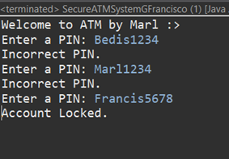
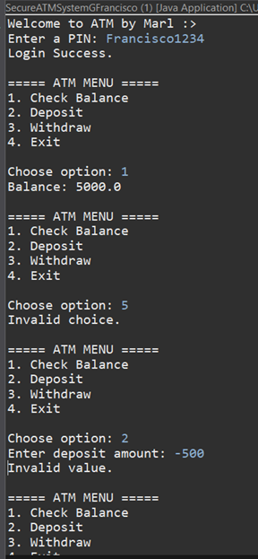
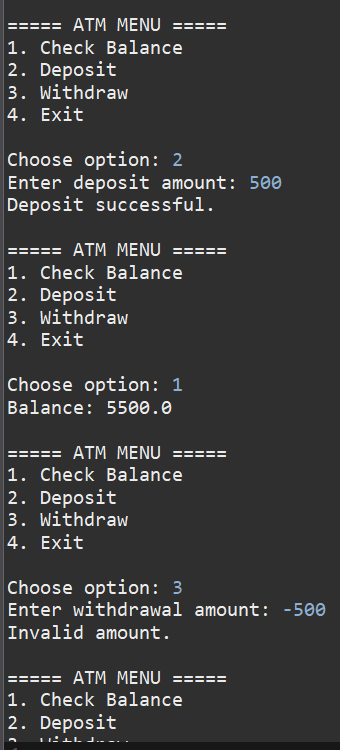
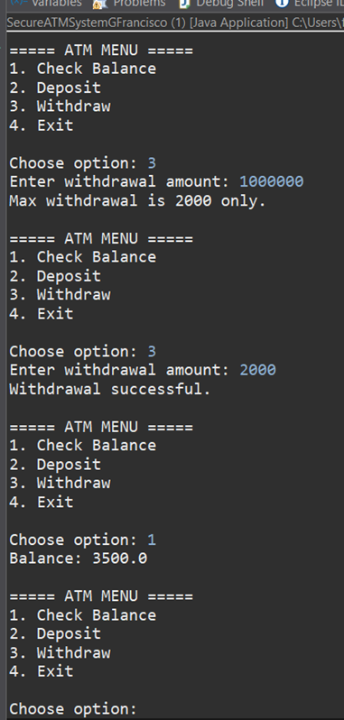
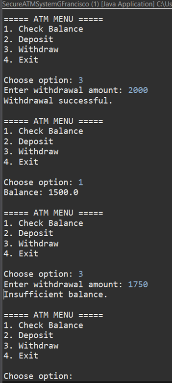
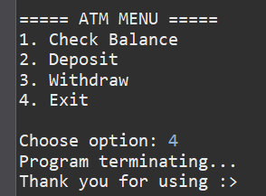

# Object-Oriented Programming - Midterm Activity # 3
📅 **Date:** 
Mar 27, 2026

✔️ **Score:**
*not announced yet*

📄 **Submitted Work:**
[View PDF](BSIT2-1N_Francisco_MarlLouie_MidternActivity%233.pdf)

## About
Activity # 3 is about developing an ATM System program that accepts pin for access, and allows users to check, deposit, and withdraw balance. 

## Source Code + Explanation
#### [SecureATMSystemFrancisco.java](SecureATMSystemFrancisco.java)
As the pin is predefined, the login page syntax is all under while loops. User input is verified with nested if statements: verifies pin, but after 3 attempts, the account is locked, and the
program is terminated. After logging in, the main menu is under a do-while loop to ensure iteration after selection of options. Choices are determined in switch-case statements. 
Case 1 checks the balance, case 2 accepts the deposit amount, then undergoes if statements to not accept negative values. Case 3 requests a withdrawal amount, then next are nested-if statements for
multiple layers of verification: less than zero, more than 2000, and less that existing balance are restricted as a result. Case 4 closes the program, while the default statement informs
correct input for the main menu. 

## Output + Explanation

Three incorrect PIN inputs at the login interface lead to locking of the account.

Correct PIN leads to the main menu, checking balance with 5000 initially. Outside the range of main menu options is invalid. In depositing, negative values are not allowed.

Successful deposit, update of balance. Negative values are also not allowed in withdrawal.

Adheres to the 2000 max withdrawal rule, successful withdrawal, and checking balance.

As 1500 is the remaining balance, withdraw amount that exceed it are not permitted.

Finally, terminating the program by choosing 4.

## Reflection
Developing password inputs is not my forte, but this activity helped me comprehend it. Passwords are exclusive, but easier than I thought they would be. I have considered
using console as intended for passwords. But my IDE would not allow me. My knowledge in nested if statements solidified, too. I have learned the difference between nested if and else if.
In multilayer verification, the nested if stood out. As such, I no longer struggle to implement if statements, is good for my future development.
