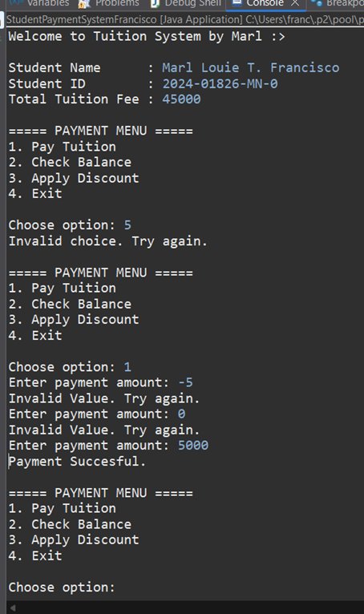
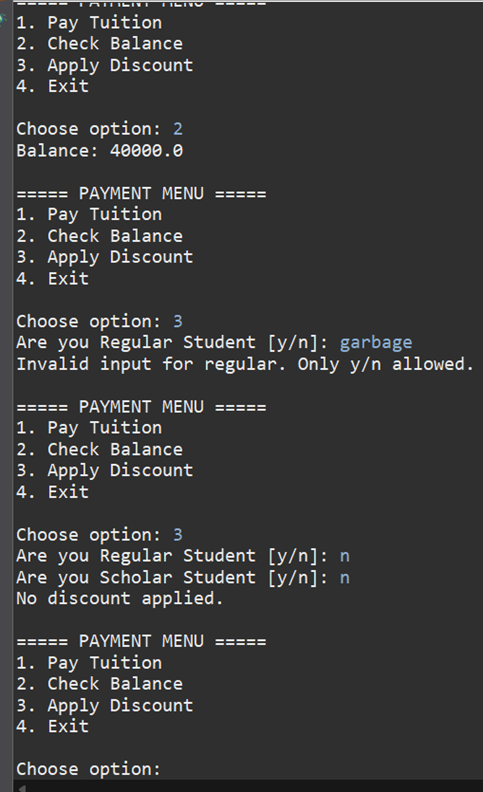
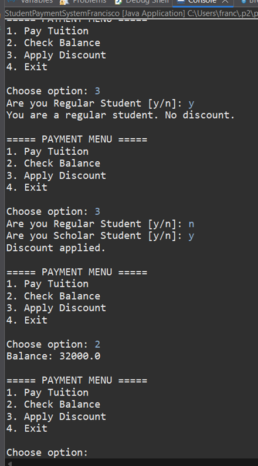
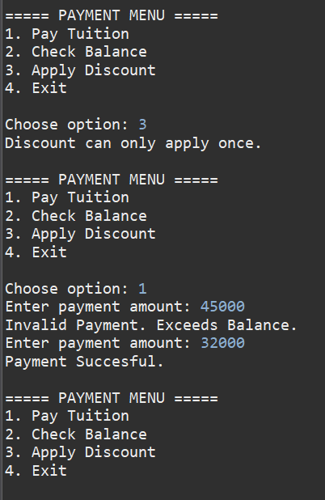
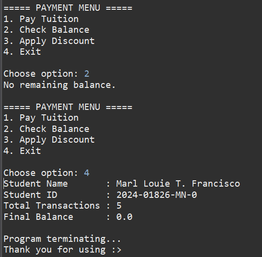

# Object-Oriented Programming - Midterm Activity # 4
📅 **Date:** 
March 27, 2026

✔️ **Score:**
*not announced yet*

📄 **Submitted Work:**
[View PDF](BSIT2-1N_Francisco_MarlLouie_MidternActivity%234.pdf)

## About
This activity is a mini-program development of a student's tuition payment system. This offers input of student details and allows them to choose options to settle the balance 
such as actualizing payment, applying a discount for a scholarship, and checking the balance. 

## Source Code + Explanation
#### [StudentPaymentSystemFrancisco.java](StudentPaymentSystemFrancisco.java)
Developed is an introductory interface that asks for student details such as name, ID, and tuition fee. These inputs are stored in appropriate variables. 
Then, the main menu is presented with options: pay tuition, check balance, apply discount, and terminate the program. This is under a do-while loop to ensure iteration after operations are 
conducted. Choosing case 1 is to pay the tuition balance, but it has to undergo verifications in nested if statements. If the student has settled the balance, payment can no longer proceed. 
The program only accepts valid digits and numbers greater than zero. When an amount is accepted, it is subtracted from the balance. Case 2 prints the remaining balance, 
but if the whole balance is paid, it prints a message that the balance is settled. On the other case, choosing 3 leads to the application of a discount: the program specifically asks 
if the student is under scholarship, if so, 20% discount is deducted from the balance. Other inputs lead to rejection of applications due to nested if statements implemented. 
Lastly, in case 4, the student's details are finally printed, the total number of transactions, and the final balance, and then the program terminates.

## Output + Explanation

The initial interface requires input details. Showcases an invalid choice in the main menu. Verify a valid payment amount, does not accept irregular inputs.

Displays balance, discount application does not accept garbage input, and rejects "N"/"n".

Rejects regular student, and finally accepts "y"/"Y" as a scholar student.

Ensures the discount is applied once only. Payment does not accept an amount that exceeds the balance, but an exact amount or less than the balance is accepted. 

No balance remains, as seen in option 2 and the final balance. Choosing 4 leads to program termination and final output, such as details and transactions.

## Reflection
With this activity, I explored the various uses of variables in a program. One variable can become a counter that tracks a certain event during program execution. Also, one variable 
can verify an occurrence of an activity, such as the discount application, that strictly occurs only once. That is, with the help of an if statement to fortify the verification syntaxes. 
I also implemented a 'super' nested if. As someone who still struggles with reading if statements, this activity, as it is required, needed for me to comprehend. I also probed 
other predefined functions, such as toLowerCase(); that is beneficial in manipulating user inputs. And understood the purpose of closing the scanner to prevent leaks. 
