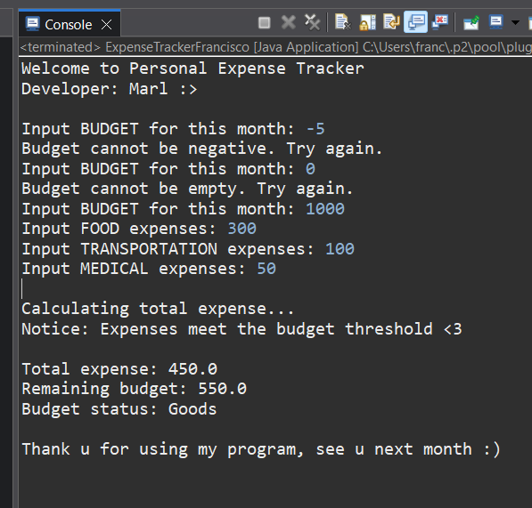
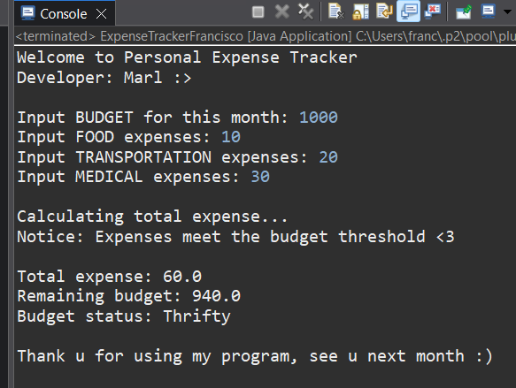
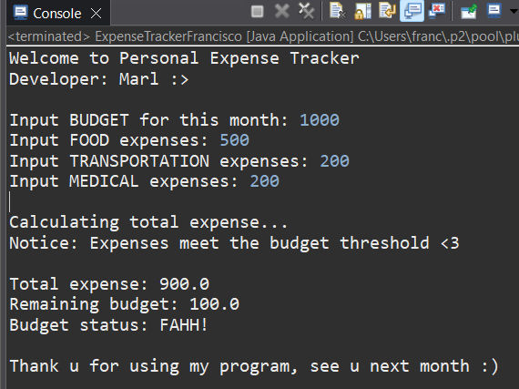
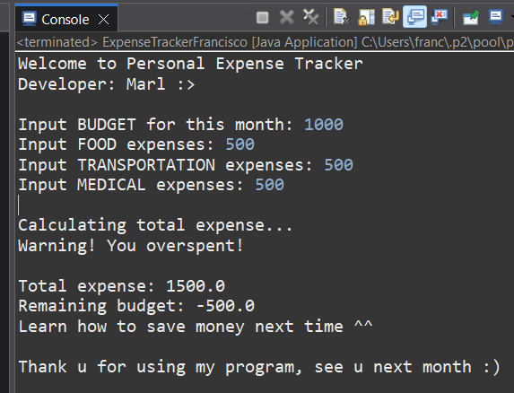

# Object-Oriented Programming - Midterm Activity # 5
📅 **Date:** 
April 11, 2026

✔️ **Score:**
*not announced yet*

📄 **Submitted Work:**
[View PDF](ExpenseTrackerFrancisco.pdf)

## About
The given activity aims to demonstrate the implementation of Java methods in this budget tracker program. Initially asks for expenses in categories. Features are calculating the expense 
and the remaining budget then provides an insight.  

## Source Code + Explanation
#### [ExpenseTrackerFrancisco.java](ExpenseTrackerFrancisco.java)
Four methods can be seen in the program. First simply prints the introduction. The second method accepts all expenses input and returns the sum of these expenses. While the third checks 
if the total expense exceeds the balance and returns a message to inform the user about their expense habits. Lastly, the final method calculates the remaining budget, prints these derived 
values, and provides some classification and a message. Status is determined by comparing the remaining budget and initial budget before all expenses; and is classified according to their 
percentages. In the main method, the defined methods are called accordingly. Displays title, then asks for inputs, passes these inputs to the method to perform calculations. 
Until the display of expense insights. After all operations, the program terminates with a farewell message.

## Output + Explanation

Demonstrates strict input format, negative values, and zero are not allowed. This output is an example of an 'expected' or a 'middle ground' result, meeting the budget threshold, 
total expense, remaining budget, and status are displayed with ease. "Goods" ranges 40%-60% of the budget not spent.

Showcase the flexibility of status, whereas "Thrifty" signifies 90%-100% of the budget not spent.

"FAHH!" is the status when 0% to 10% of the budget remains.

This output reflects overspending, with a calculated negative value of remaining budget. Provides a warning and a suggestion instead of a status.

## Reflection
For me, this is a refreshing activity that allows me to further comprehend the Java methods. The difference between void methods and methods with a return type; is highly beneficial 
in arranging and managing blocks of code. There is no need to iterate a function whenever it is desired to use it again, hence methods are powerful. Another is learning to differentiate 
between static and instance methods. Static is used in displaying the title and expenses insights. I simply called the methods. On the other side, methods that I intend to generate or 
return as a result are assigned to a variable inside the main method. All confusion in my mind is now cleared. 
